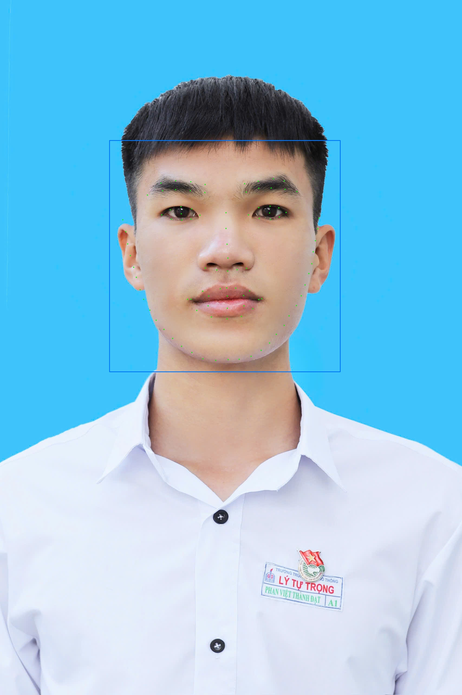

# 🚗 AI Driver Monitoring System

<p align="center">
  <b>Real-time Driver Monitoring System using facial landmark detection, EAR/MAR analysis, head pose estimation, and audio warning.</b>
</p>

<p align="center">
  Python • PyTorch • OpenCV • MediaPipe • Computer Vision • Edge AI
</p>

---

## 🎬 Demo

### 98-Point Facial Landmark Detection

| Input Image | Detection Result |
|---|---|
|  |  |

The system detects the driver's face and predicts **98 facial landmarks** for eye, mouth, and head-pose analysis.

---

## 📌 Overview

This project implements a real-time **Driver Monitoring System (DMS)** based on computer vision and deep learning.

The system uses a camera to detect the driver's face, estimate 98 facial landmarks, and analyze facial geometry to support driver-state monitoring.

Main processing stages:

- Face detection using MediaPipe
- Face preprocessing
- 98-point facial landmark regression
- Eye Aspect Ratio (EAR)
- Mouth Aspect Ratio (MAR)
- Head pose estimation
- Real-time warning logic
- Audio warning

The facial landmark model is based on a modified **MobileNetV2** architecture and trained using the **WFLW facial landmark dataset**.

---

## 🧠 System Pipeline

```text
Camera / Input Image
        │
        ▼
┌─────────────────────┐
│   Face Detection    │
│      MediaPipe      │
└─────────────────────┘
        │
        ▼
┌─────────────────────┐
│ Face Preprocessing  │
│ Grayscale + 112x112 │
└─────────────────────┘
        │
        ▼
┌─────────────────────┐
│ Modified MobileNetV2│
└─────────────────────┘
        │
        ▼
┌─────────────────────┐
│ 98 Facial Landmarks │
└─────────────────────┘
        │
        ├──────────────► EAR ───────► Eye Analysis
        │
        ├──────────────► MAR ───────► Mouth Analysis
        │
        └──────────────► SolvePnP ──► Head Pose
                                         │
                                         ▼
                               Driver-State Logic
                                         │
                                         ▼
                               Visual / Audio Alert
```

---

## ✨ Features

- Real-time face detection with MediaPipe
- 98-point facial landmark detection
- Modified MobileNetV2 regression model
- Eye Aspect Ratio calculation
- Mouth Aspect Ratio calculation
- Head pose estimation using SolvePnP
- Pitch, yaw, and roll estimation
- Real-time webcam processing
- Landmark smoothing
- Audio warning
- Static image inference
- WFLW training pipeline
- Model evaluation utilities
- Google Colab training notebook

---

## 🧩 Facial Landmark Model

The facial landmark detector uses a customized **MobileNetV2** architecture.

### Input

```text
Grayscale face image
        ↓
     112 × 112
```

### Output

```text
98 landmarks × 2 coordinates
        ↓
196 regression outputs
```

Each landmark contains normalized `(x, y)` coordinates.

### Main Modifications

- RGB input changed to grayscale input
- First convolution adapted for 1 input channel
- ReLU6 replaced with ReLU
- Additional convolutional processing
- Custom regression head
- Final output layer with 196 values

---

## 👁️ Driver-State Analysis

### Eye Aspect Ratio — EAR

EAR is calculated from landmarks around the eyes and provides information about eye opening.

```text
Eye Landmarks
      ↓
     EAR
      ↓
Eye-State Analysis
```

### Mouth Aspect Ratio — MAR

MAR is calculated from landmarks around the mouth and provides information about mouth opening.

```text
Mouth Landmarks
       ↓
      MAR
       ↓
Mouth / Yawning Analysis
```

### Head Pose Estimation

Head orientation is estimated using OpenCV `solvePnP`.

The system estimates:

- Pitch
- Yaw
- Roll

```text
Facial Landmarks
       ↓
Selected 2D Points
       ↓
3D Face Reference
       ↓
OpenCV SolvePnP
       ↓
Pitch / Yaw / Roll
```

---

## 📁 Project Structure

```text
AI-Driver-Monitoring-System/
│
├── assets/
│   ├── test.jpg
│   └── output.jpg
│
├── notebooks/
│   └── Train_Colab.ipynb
│
├── src/
│   ├── alarm_pip.wav
│   ├── dataset.py
│   ├── ear_utils.py
│   ├── evaluate.py
│   ├── Hinhnen.jpg
│   ├── model.py
│   ├── realtime.py
│   ├── test_image.py
│   └── train.py
│
├── .gitignore
├── LICENSE
├── README.md
└── requirements.txt
```

The pretrained model is downloaded separately from GitHub Releases.

---

## 📦 Pretrained Model

Download the pretrained **98-point facial landmark model**:

### [⬇️ Download landmark.pth — v1.0.0](https://github.com/datphan10/AI-Driver-Monitoring-System/releases/download/v1.0.0/landmark.pth)

After downloading, place the model in the project root:

```text
AI-Driver-Monitoring-System/
├── landmark.pth
├── assets/
├── notebooks/
├── src/
├── README.md
└── requirements.txt
```

---

## ⚙️ Installation

### 1. Clone the repository

```bash
git clone https://github.com/datphan10/AI-Driver-Monitoring-System.git
cd AI-Driver-Monitoring-System
```

### 2. Create a Python virtual environment

Recommended:

```text
Python 3.10
```

Windows:

```bash
py -3.10 -m venv .venv
```

Activate:

```bash
.venv\Scripts\activate
```

### 3. Install dependencies

```bash
python -m pip install --upgrade pip
pip install -r requirements.txt
```

---

## 📚 Main Dependencies

```text
numpy==1.26.4
opencv-contrib-python==4.11.0.86
mediapipe==0.10.21
torch==2.13.0
torchvision==0.28.0
```

> The project currently uses MediaPipe's legacy `mp.solutions` API.  
> `mediapipe==0.10.21` is recommended for compatibility.

---

## 🖼️ Run Static Image Test

Default input:

```text
assets/test.jpg
```

Run:

```bash
python src/test_image.py
```

Output:

```text
assets/output.jpg
```

The result contains:

- Face bounding box
- 98 predicted facial landmarks

---

## 🎥 Run Real-Time Driver Monitoring

Make sure a webcam is connected.

Run:

```bash
python src/realtime.py
```

Real-time processing:

```text
Camera
  ↓
Face Detection
  ↓
98 Facial Landmarks
  ↓
EAR + MAR + Head Pose
  ↓
Driver-State Analysis
  ↓
Visual / Audio Warning
```

---

## 🏋️ Training

The model is trained using the **WFLW facial landmark dataset**.

The training pipeline includes:

- Face bounding-box cropping
- Grayscale conversion
- Resize to 112 × 112
- Landmark normalization
- Wing Loss
- Increased weighting for eye landmarks
- Increased weighting for mouth landmarks
- Adam optimizer
- Cosine annealing learning-rate scheduler
- Gradient clipping
- Early stopping

Run:

```bash
python src/train.py
```

Google Colab notebook:

```text
notebooks/Train_Colab.ipynb
```

---

## 📊 Training Configuration

| Parameter | Value |
|---|---:|
| Input size | 112 × 112 |
| Input channels | 1 |
| Facial landmarks | 98 |
| Model outputs | 196 |
| Batch size | 64 |
| Maximum epochs | 80 |
| Learning rate | 0.001 |
| Weight decay | 1e-5 |
| Optimizer | Adam |
| Loss function | Wing Loss |
| LR scheduler | Cosine Annealing |
| Early stopping patience | 10 |

Landmark weighting:

```text
Eye landmarks   → 5×
Mouth landmarks → 2×
```

---

## 📈 Evaluation

Evaluation script:

```text
src/evaluate.py
```

Run:

```bash
python src/evaluate.py
```

The evaluation workflow can be used to analyze landmark prediction accuracy and inference performance.

---

## 🛠️ Tech Stack

<p align="center">

**Python** • **PyTorch** • **TorchVision** • **OpenCV** • **MediaPipe** • **NumPy**

</p>

---

## 🚀 Future Improvements

- [ ] Add real-time demo GIF/video
- [ ] Improve robustness under difficult lighting
- [ ] Improve landmark accuracy for large head rotations
- [ ] Optimize inference for edge devices
- [ ] Export model to ONNX
- [ ] Apply model quantization
- [ ] Benchmark FPS and latency on edge hardware
- [ ] Add systematic DMS performance evaluation

---

## ⚠️ Disclaimer

This project is developed for educational and research purposes.

It is not intended to replace certified automotive driver-monitoring or safety systems.

---

## 👤 Author

**Phan Việt Thành Đạt**

GitHub: [@datphan10](https://github.com/datphan10)

---

## 📄 License

This project is released under the MIT License.

See [`LICENSE`](LICENSE) for details.

---

<p align="center">
  <b>Computer Vision • Deep Learning • Edge AI</b>
</p>
